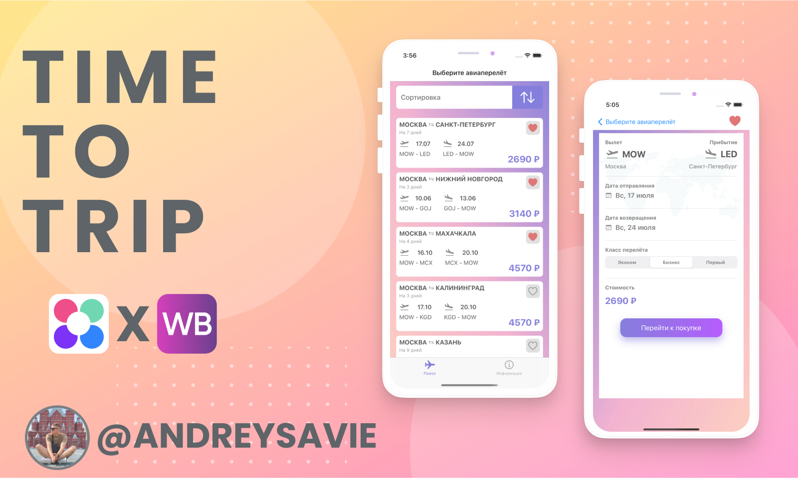
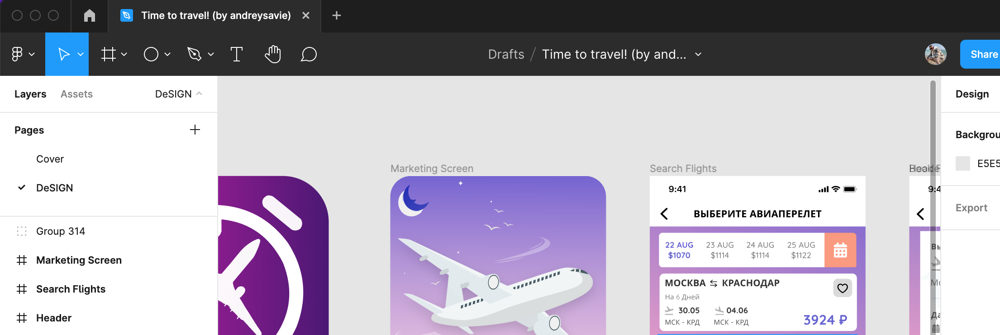

# Time to Travel! (Пора в путешествие!)

Приложение Time to Travel! было разработано [Андреем Рыбалкиным](https://t.me/andreysavie) и написано на Swift 5 в рамках совместного проекта [Нетологии](https://netology.ru/) и [Wildberries](https://www.wildberries.ru)

Репозиторий содержит проект, разработынный в качестве исполнения тестового задания.

<h3 align="center">

</h3>

## Про дизайн

Все элементы дизайна, включая иконку приложения, Launch Screen и [проект в Figma](https://www.figma.com/file/soZsSDV4G5HWl2wEYjsDp4/Time-to-travel-by-andreysavie) были разработаны лично мной, для удобства вёрстки и создания приятного и удобного UI/UX (Прошу не судить строго, это моя первая работа в Figma 🥹)

<h3 align="center">

</h3>

## Совместимость

Этот проект написан на Swift версии 5.6.1 и доступен для Xcode версии 13 и более поздних (поддержка iOS минимальной версии 15.4)

## Про код

Проект построен практически без использования архитектурных паттернов (за исключением одного экрана, MVC). При написании я старался придерживаться принципов ООП и Solid. Вёрстка интерфейса осуществлена с помощью UIKit на основе дизайн-проекта. Вёрстка адаптивная, с использованием AutoLayout, интерфейс правильно отображается на всех моделях мобильных телефонов Apple. Для улучшения интерфейса и приятности пользования были использованы градиенты и анимация. 
Приложение полностью соответствует требованиям задания, а так же имеет дополнительные функции, такие как сортировка списка. 
Подробнее о стеке проекта я рассказал во вкладке "информация" приложения.

## Автор

* [Андрей Рыбалкин, группа iOS-18](https://github.com/andreysavie)

